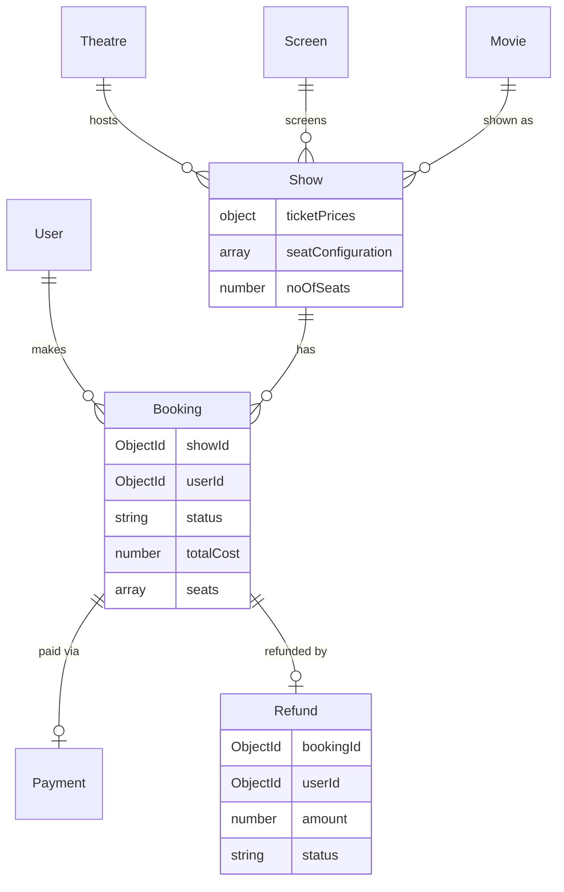

# Design Document — Movie Booking Core Features

## Overview

This document describes the technical design for five core features that close the critical gaps in
the movie booking backend. The existing codebase has a working auth layer, theatre/screen
management, movie catalog, and the skeleton of bookings and payments — but several pieces are
missing or broken that prevent any end-to-end booking flow from succeeding.

The five changes are tightly coupled: route registration makes the endpoints reachable, the schema
fix makes the booking service coherent, the cron job prevents seat hoarding, the cancellation flow
completes the booking lifecycle, and per-seat-type pricing makes cost calculation accurate. All five
must land together for the system to be production-ready.

**Key design decisions (confirmed by user):**
- Refunds live in a separate `refunds` MongoDB collection (not a subdocument on Booking).
- Refunds are always full refunds — `amount` equals `booking.totalCost`.
- Seat lock expiry uses `node-cron` (to be added as a dependency).

---

## Architecture

The application follows a layered architecture already established in the codebase:

```
HTTP Request
    │
    ▼
Routes (v1Router → sub-routers)
    │
    ▼
Controllers  (req/res handling, input extraction)
    │
    ▼
Services     (business logic, orchestration)
    │
    ▼
Repositories (data access via Mongoose models)
    │
    ▼
MongoDB (Mongoose schemas)
```

A background layer sits alongside the HTTP layer:

```
node-cron Scheduler
    │
    ▼
Expiry Job (queries DB, updates Bookings + Shows)
```

No new architectural layers are introduced. All five features fit within the existing pattern.

```mermaid
graph TD
    Client -->|HTTP| APIRouter[apiRouter /api]
    APIRouter --> V1Router[v1Router /v1]
    V1Router --> UserRouter[/user]
    V1Router --> TheatreRouter[/theatres]
    V1Router --> ScreenRouter[/screen]
    V1Router --> MovieRouter[/movies  NEW]
    V1Router --> ShowRouter[/shows  NEW]
    V1Router --> BookingRouter[/bookings  NEW]
    V1Router --> PaymentRouter[/payments  NEW]
    V1Router --> RefundRouter[/refunds  NEW]

    BookingRouter -->|isAuthenticated| BookingController
    PaymentRouter -->|isAuthenticated on mutations| PaymentController
    BookingController --> BookingService
    PaymentController --> PaymentService
    BookingService --> BookingRepo
    BookingService --> ShowRepo
    PaymentService --> BookingRepo
    PaymentService --> ShowRepo

    CronScheduler[node-cron every 1 min] --> ExpiryJob
    ExpiryJob --> BookingRepo
    ExpiryJob --> ShowRepo

    CancellationService --> BookingRepo
    CancellationService --> ShowRepo
    CancellationService --> RefundRepo
```

---

## Components and Interfaces

### 1. Route Registration (`v1Router.js`)

**What changes:** Mount four new sub-routers and one refund sub-router. Apply `isAuthenticated`
middleware on mutation routes within each sub-router (following the existing pattern in
`screen.js` and `theatre.js`).

**New files to create:**
- `src/Routes/v1/movie.js`
- `src/Routes/v1/show.js`
- `src/Routes/v1/booking.js`
- `src/Routes/v1/payment.js`
- `src/Routes/v1/refund.js`

**Updated `v1Router.js`:**
```js
router.use('/movies',   movieRouter);
router.use('/shows',    showRouter);
router.use('/bookings', bookingRouter);
router.use('/payments', paymentRouter);
router.use('/refunds',  refundRouter);
```

**Route definitions per sub-router:**

| Sub-router | Method | Path | Auth | Controller |
|---|---|---|---|---|
| movie | GET | `/` | — | `getMoviesController` |
| movie | POST | `/` | `isAuthenticated` | `createMovieController` |
| movie | GET | `/:id` | — | `getMovieByIdController` |
| movie | DELETE | `/:id` | `isAuthenticated` | `deleteMovieController` |
| show | GET | `/` | — | `getShowsController` |
| show | POST | `/` | `isAuthenticated` | `createShowController` |
| show | PATCH | `/:id` | `isAuthenticated` | `updateShowController` |
| show | DELETE | `/:id` | `isAuthenticated` | `deleteShowController` |
| booking | GET | `/` | `isAuthenticated` | `getAllBookingsController` |
| booking | POST | `/` | `isAuthenticated` | `createBookingController` |
| booking | GET | `/:id` | `isAuthenticated` | `getBookingByIdController` |
| booking | PATCH | `/:id` | `isAuthenticated` | `updateBookingController` |
| booking | POST | `/:id/cancel` | `isAuthenticated` | `cancelBookingController` |
| payment | GET | `/` | `isAuthenticated` | `getAllPaymentsController` |
| payment | POST | `/` | `isAuthenticated` | `createPaymentController` |
| payment | GET | `/:id` | `isAuthenticated` | `getPaymentByIdController` |
| refund | GET | `/` | `isAuthenticated` | `getAllRefundsController` |

**Note on existing show controller:** `src/controllers/show.js` imports from `../services/showService.js`
(wrong path — the file is `services/show.js`). This import path must be corrected when creating the
show router.

---

### 2. Booking Schema Fix (`schema/booking.js`)

Add `showId` as a required `ObjectId` reference to `Show`:

```js
showId: {
    type: mongoose.Schema.Types.ObjectId,
    required: true,
    ref: 'Show'
}
```

The existing `timing` field (a plain `String`) is kept as-is for backward compatibility. The new
`showId` field is the authoritative link to the Show document.

---

### 3. Seat Lock Expiry Cron Job (`jobs/seatLockExpiry.js`)

**Dependency:** `node-cron` must be added — `npm install node-cron@3.0.3`.

**Schedule:** `'* * * * *'` (every 1 minute).

**Algorithm:**
1. Calculate the cutoff timestamp: `new Date(Date.now() - 10 * 60 * 1000)`.
2. Query: `Booking.find({ status: 'processing', createdAt: { $lt: cutoff } })`.
3. For each expired booking:
   a. Fetch the associated Show by `booking.showId`.
   b. For each seat in `booking.seats`, find the matching entry in `show.seatConfiguration`
      (match on `row` and `number`) and set its `status` to `'available'`.
   c. Set `booking.status = 'expired'`.
   d. Call `show.save()` then `booking.save()`.
   e. If any error occurs for this booking, log it and `continue` to the next booking.
4. Log a summary of how many bookings were expired.

**Startup integration (`src/index.js`):**
```js
import './jobs/seatLockExpiry.js';
```

The import side-effect registers the cron schedule when the server starts.

---

### 4. Cancellation and Refund Flow

**New schema:** `src/schema/refund.js`

```js
const refundSchema = mongoose.Schema({
    bookingId: { type: ObjectId, required: true, ref: 'Booking' },
    userId:    { type: ObjectId, required: true, ref: 'User' },
    amount:    { type: Number,   required: true },
    status:    { type: String,   enum: ['pending', 'processed', 'failed'], default: 'pending' }
}, { timestamps: true });
```

**New repository:** `src/repositiories/refund.js` — wraps `crudRepository(Refund)`.

**New service function:** `cancelBookingService` in `src/services/booking.js` (or a dedicated
`src/services/cancellation.js`). Design uses a dedicated file for clarity.

**Algorithm (`cancelBookingService(bookingId, userId)`):**
1. Fetch booking by `bookingId`. If not found → 404.
2. Ownership check: `booking.userId.toString() !== userId.toString()` → 403.
3. Status check: `booking.status !== 'successfull'` → 400 with message "Booking is not eligible for cancellation".
4. Fetch show by `booking.showId`. If not found → 404.
5. Time check: `show.timming - Date.now() < 30 * 60 * 1000` → 400 with message "Cannot cancel within 30 minutes of show time".
6. Release seats: for each seat in `booking.seats`, find matching seat in `show.seatConfiguration` and set `status = 'available'`.
7. Increment `show.noOfSeats += booking.noOfSeats`.
8. Set `booking.status = 'cancelled'`.
9. Create Refund: `{ bookingId: booking._id, userId: booking.userId, amount: booking.totalCost, status: 'pending' }`.
10. Save: `await show.save()`, `await booking.save()`, `await refundRepository.create(refundData)`.
11. Return `{ booking, refund }`.

**New controller:** `cancelBookingController` in `src/controllers/booking.js`.

---

### 5. Per-Seat-Type Pricing

**Show schema change (`schema/show.js`):**

Remove the `price: { type: Number, required: true }` field. Replace with:

```js
ticketPrices: {
    regular:  { type: Number, required: true, min: 0 },
    premium:  { type: Number, required: true, min: 0 },
    recliner: { type: Number, required: true, min: 0 }
}
```

**`createShowService` validation:** Mongoose `required: true` on each sub-field handles the
missing-key validation. The service should additionally check that all three keys are present in
`data.ticketPrices` before calling `showRepository.create`, to return a descriptive error listing
missing keys rather than a raw Mongoose validation error.

**`createBookingService` pricing change:**

Replace the flat-price calculation:
```js
// OLD
data.totalCost = selectedSeats.length * show.price;

// NEW
data.totalCost = selectedSeats.reduce((sum, seat) => {
    const foundSeat = seatConfig.find(s => s.row === seat.row && s.number === seat.number);
    const price = show.ticketPrices[foundSeat.type];
    if (price === undefined) {
        throw new clientError({
            message: `No price configured for seat type: ${foundSeat.type}`,
            statusCode: StatusCodes.BAD_REQUEST
        });
    }
    return sum + price;
}, 0);
```

**`updateShowService` guard:** Before applying a `ticketPrices` update, check:
```js
if (data.ticketPrices) {
    const activeBookings = await bookingRepository.getAll({
        showId: showId,
        status: { $in: ['successfull', 'processing'] }
    });
    if (activeBookings.length > 0) {
        throw new clientError({
            message: 'Cannot update prices while active bookings exist',
            statusCode: StatusCodes.CONFLICT
        });
    }
}
```

**`createPaymentService` — no change needed:** It already compares `payment.amount` to
`booking.totalCost`. Since `totalCost` is now computed from per-type pricing, the comparison
remains correct without modification.

---

## Data Models

### Booking (updated)

```
Booking {
  _id:        ObjectId
  showId:     ObjectId  (ref: Show)   ← NEW, required
  theatreId:  ObjectId  (ref: Theatre)
  movieId:    ObjectId  (ref: Movie)
  userId:     ObjectId  (ref: User)
  timing:     String
  noOfSeats:  Number
  totalCost:  Number
  status:     'processing' | 'cancelled' | 'successfull' | 'expired'
  seats:      [{ seatNumber: Number, row: String }]
  createdAt:  Date
  updatedAt:  Date
}
```

### Show (updated)

```
Show {
  _id:              ObjectId
  theatreId:        ObjectId  (ref: Theatre)
  screenId:         ObjectId  (ref: Screen)
  movieId:          ObjectId  (ref: Movie)
  timming:          Date
  seatConfiguration:[{ row: String, number: Number, type: String, status: String }]
  ticketPrices:     { regular: Number, premium: Number, recliner: Number }  ← REPLACES price
  noOfSeats:        Number
  format:           '2d' | '3d'
  createdAt:        Date
  updatedAt:        Date
}
```

### Refund (new)

```
Refund {
  _id:       ObjectId
  bookingId: ObjectId  (ref: Booking)
  userId:    ObjectId  (ref: User)
  amount:    Number
  status:    'pending' | 'processed' | 'failed'
  createdAt: Date
  updatedAt: Date
}
```

### Payment (unchanged)

```
Payment {
  _id:     ObjectId
  booking: ObjectId  (ref: Booking)
  amount:  Number
  status:  'pending' | 'failed' | 'success'
  method:  'card' | 'upi' | 'netbanking' | 'wallet'
}
```

### Entity Relationship Diagram



---

## Correctness Properties

*A property is a characteristic or behavior that should hold true across all valid executions of a
system — essentially, a formal statement about what the system should do. Properties serve as the
bridge between human-readable specifications and machine-verifiable correctness guarantees.*

**Property reflection:** After prework analysis, the following consolidations were made:
- Requirements 3.2 and 3.3 both describe what the expiry query selects and what it does to those
  bookings. They are combined into one property (Property 1).
- Requirements 4.5, 4.6, and 4.7 all describe state changes on an approved cancellation. They are
  combined into one comprehensive property (Property 4) alongside the refund creation (4.8).
- Requirements 4.1 and 4.2 are independent guards (ownership vs. status) and remain separate.

---

### Property 1: Expiry selects and marks only stale processing bookings

*For any* set of bookings with varying statuses and `createdAt` timestamps, running the expiry
logic should set `status = 'expired'` on exactly those bookings whose status is `'processing'`
AND whose `createdAt` is older than 10 minutes — and leave all other bookings unchanged.

**Validates: Requirements 3.2, 3.3**

---

### Property 2: Expiry releases all seats of expired bookings

*For any* show's `seatConfiguration` and any expired booking referencing that show, after the
expiry logic runs, every seat in `show.seatConfiguration` whose `row` and `number` match an entry
in `booking.seats` should have `status = 'available'`.

**Validates: Requirements 3.4**

---

### Property 3: Expiry error isolation

*For any* collection of N expired bookings where processing one booking throws an error, the
remaining N-1 bookings should still be processed to `expired` status (the error does not halt
the loop).

**Validates: Requirements 3.6**

---

### Property 4: Cancellation ownership guard

*For any* booking and any user who is not the booking's owner, a cancellation request should be
rejected with a 403 error — regardless of the booking's status or the show's timing.

**Validates: Requirements 4.1**

---

### Property 5: Cancellation status guard

*For any* booking whose status is not `'successfull'` (i.e., `processing`, `cancelled`, or
`expired`), a cancellation request should be rejected with a 400 error.

**Validates: Requirements 4.2**

---

### Property 6: Cancellation time cutoff guard

*For any* show whose `timming` is within 30 minutes of the current time, a cancellation request
for a booking of that show should be rejected with a 400 error.

**Validates: Requirements 4.4**

---

### Property 7: Approved cancellation produces consistent state

*For any* approved cancellation (owner, status=successfull, show time > 30 min away), after the
operation completes:
- Every seat in `show.seatConfiguration` matching `booking.seats` has `status = 'available'`
- `show.noOfSeats` equals its pre-cancellation value plus `booking.noOfSeats`
- `booking.status` equals `'cancelled'`
- A Refund document exists with `bookingId = booking._id`, `userId = booking.userId`,
  `amount = booking.totalCost`, and `status = 'pending'`

**Validates: Requirements 4.5, 4.6, 4.7, 4.8**

---

### Property 8: Per-seat-type total cost calculation

*For any* show with a `ticketPrices` map and any selection of seats with known types, the
`totalCost` computed by `createBookingService` should equal the sum of
`ticketPrices[seat.type]` for each selected seat.

**Validates: Requirements 5.3**

---

### Property 9: Payment outcome determined by amount vs totalCost

*For any* payment amount and booking `totalCost`, the payment service should set
`payment.status = 'success'` if and only if `payment.amount === booking.totalCost`, and
`payment.status = 'failed'` otherwise.

**Validates: Requirements 5.5**

---

### Property 10: Active bookings block ticket price updates

*For any* show that has at least one booking with status `'successfull'` or `'processing'`, an
attempt to update `ticketPrices` should be rejected with a conflict error.

**Validates: Requirements 5.6**

---

## Error Handling

All error handling follows the existing pattern: throw `clientError` (for 4xx) or let unexpected
errors propagate to the controller, which catches and returns the appropriate HTTP status.

| Scenario | Error type | HTTP status | Message |
|---|---|---|---|
| Booking created without `showId` | Mongoose ValidationError | 400 | "Booking validation failed: showId: Path `showId` is required" |
| Show created without all `ticketPrices` keys | `clientError` | 400 | "Missing ticket prices for: [list of missing keys]" |
| Booking seat type not in `ticketPrices` | `clientError` | 400 | "No price configured for seat type: {type}" |
| Cancel booking — not owner | `clientError` | 403 | "Unauthorized: you do not own this booking" |
| Cancel booking — wrong status | `clientError` | 400 | "Booking is not eligible for cancellation" |
| Cancel booking — within 30 min | `clientError` | 400 | "Cannot cancel within 30 minutes of show time" |
| Update ticketPrices with active bookings | `clientError` | 409 | "Cannot update prices while active bookings exist" |
| Cron job per-booking error | `console.error` + `continue` | — | Logged, does not throw |
| Show not found during expiry | `console.error` + `continue` | — | Logged, does not throw |

---

## Testing Strategy

### Approach

The project currently has no test framework. The recommended setup is **Vitest** (ESM-native,
zero-config for this project's `"type": "module"` setup) with **fast-check** for property-based
tests.

```bash
npm install --save-dev vitest@2.1.9 fast-check@3.22.0
```

Add to `package.json`:
```json
"scripts": {
  "test": "vitest --run"
}
```

### Unit Tests (example-based)

Focus on specific scenarios and edge cases:

- **Route registration smoke tests**: Verify each new sub-router is mounted and returns non-404 for
  known paths (using `supertest` against the Express app).
- **Booking schema**: Create a booking without `showId` → expect Mongoose validation error.
- **Show schema**: Create a show without `ticketPrices.regular` → expect validation error.
- **Auth guard**: POST `/api/v1/bookings` without token → expect 403.
- **Cancellation edge cases**: Cancel a `processing` booking → expect 400; cancel within 30 min →
  expect 400.

### Property-Based Tests

Each property test uses `fast-check` and runs a minimum of **100 iterations**.
Tag format: `// Feature: movie-booking-core-features, Property {N}: {property_text}`

| Property | Generator inputs | What is verified |
|---|---|---|
| P1: Expiry selects stale processing bookings | Random bookings with varying status + createdAt offsets | Only status=processing AND age>10min are expired |
| P2: Expiry releases seats | Random seatConfiguration + booking.seats subsets | All matched seats → available after expiry |
| P3: Expiry error isolation | N expired bookings, one throws | N-1 others still processed |
| P4: Cancellation ownership guard | Random userId ≠ booking.userId | Always returns 403 |
| P5: Cancellation status guard | Random status ∈ {processing, cancelled, expired} | Always returns 400 |
| P6: Cancellation time cutoff | Random show timming within [0, 30) minutes from now | Always returns 400 |
| P7: Approved cancellation state | Random valid booking + show | All four state invariants hold |
| P8: Per-seat-type cost calculation | Random seat arrays with types + ticketPrices map | totalCost = Σ ticketPrices[type] |
| P9: Payment outcome | Random amount vs totalCost pairs | success iff equal, failed otherwise |
| P10: Active bookings block price update | Random show with ≥1 active booking | Update rejected with 409 |

### Integration Tests

- End-to-end booking flow: create show → create booking → create payment → verify booking status=successfull.
- End-to-end cancellation flow: create booking → mark successfull → cancel → verify refund document.
- Cron job integration: insert stale processing booking → run expiry function → verify DB state.

///////////////////////////////////////////////////////////// by me
Movies

GET /api/v1/movies — list all movies
POST /api/v1/movies — create a movie (auth required)
GET /api/v1/movies/:id — get movie by ID
DELETE /api/v1/movies/:id — delete a movie (auth required)
Shows

GET /api/v1/shows — list all shows
POST /api/v1/shows — create a show with per-seat-type pricing (regular, premium, recliner) (auth required)
PATCH /api/v1/shows/:id — update a show (blocks price changes if active bookings exist) (auth required)
DELETE /api/v1/shows/:id — delete a show (auth required)
Bookings

GET /api/v1/bookings — list all bookings (auth required)
POST /api/v1/bookings — create a booking, locks seats and calculates cost by seat type (auth required)
GET /api/v1/bookings/:id — get booking by ID (auth required)
PATCH /api/v1/bookings/:id — update a booking (auth required)
POST /api/v1/bookings/:id/cancel — cancel a booking + auto-creates a refund (auth required)
Payments

GET /api/v1/payments — list all payments (auth required)
POST /api/v1/payments — create a payment (auth required)
GET /api/v1/payments/:id — get payment by ID (auth required)
Refunds

GET /api/v1/refunds — list all refunds (auth required)
Theatres, Screens, Users — already existed before this spec

Background Jobs

Seat lock expiry cron — runs every minute, expires processing bookings older than 10 minutes and releases their seats back to available